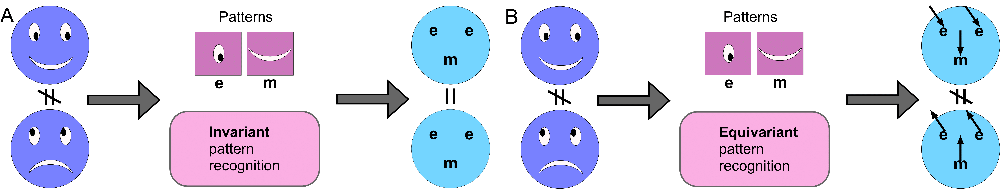

<div align="center">
  
</div>

# EquiLoPO: Equivariant to Local Patterns Orientation Network

Method presented at Paper Title: "On the Fourier analysis in the SO(3) space : EquiLoPO Network"

**Authors:** Dmitrii Zhemchuzhnikov and Sergei Grudinin

**Affiliation:** Univ. Grenoble Alpes, CNRS, Grenoble INP, LJK, 38000 Grenoble, France

A preprint of the paper is available on [arXiv](https://arxiv.org/abs/2404.15979).


## Abstract

Analyzing volumetric data with rotational invariance or equivariance is an active topic in current research. Existing deep-learning approaches utilize either group convolutional networks limited to discrete rotations or steerable convolutional networks with constrained filter structures. This work proposes a novel equivariant neural network architecture that achieves analytical Equivariance to Local Pattern Orientation on the continuous SO(3) group while allowing unconstrained trainable filters - EquiLoPO Network. Our key innovations are a group convolutional operation leveraging irreducible representations as the Fourier basis and a local activation function in the SO(3) space that provides a well-defined mapping from input to output functions, preserving equivariance. By integrating these operations into a ResNet-style architecture, we propose a model that overcomes the limitations of prior methods. A comprehensive evaluation on diverse 3D medical imaging datasets from MedMNIST3D demonstrates the effectiveness of our approach, which consistently outperforms state of the art. This work suggests the benefits of true rotational equivariance on SO(3) and flexible unconstrained filters enabled by the local activation function,  providing a flexible framework for equivariant deep learning on volumetric data with potential applications across domains.


## Repository Structure

The repository contains the source code for EquiLoPO, organized as follows:

```
EquiLoPO/
│
├── EquiLoPO/
│   ├── __init__.py
│   ├── activation.py
│   ├── basis_functions.py
│   ├── cg_coefficients.py
│   ├── compute_filters.py
│   ├── convolution.py
│   ├── global_activation.py
│   ├── pooling.py
│   ├── tensor_product.py
│   └── utils.py
│
└── setup.py
```

- `EquiLoPO/`: Contains the implementation of EquiLoPO convolution and its components.
  - `activation.py` contains the implementation of local activation function
  - `basis_functions.py` includes spherical harmonics 
  - `cg_coefficients.py` contains the implementation of Clebsch-Gordan coefficients
  - `compute_filters.py` contains the function for computing the convolution filters
  - `convolution.py` contains the implementation of the EquiLoPO convolution operation
  - `global_activation.py` contains the implementation of global activation function
  - `pooling.py` contains the implementation of the SoftMax operation
  - `tensor_product.py` contains the implementation of the tensor product operation
  - `utils.py` contains utility functions


## Getting Started

1. Clone the repository:

   ```bash
   git clone https://gricad-gitlab.univ-grenoble-alpes.fr/GruLab/ILPO.git
   ```

2. Install the package:

   ```bash
   cd EquiLoPO
   pip install .
   ```


## Citation

If you use ILPO-Net in your research, please cite the following paper:

```bibtex
@misc{zhemchuzhnikov2024ilponet,
      title={On the Fourier analysis in the {SO(3)} space : {EquiLoPO} Network}, 
      author={Dmitrii Zhemchuzhnikov and Sergei Grudinin},
      year={2024},
      eprint={2404.15979},
      archivePrefix={arXiv},
      primaryClass={cs.CV}
}
```

## License

This project is licensed under the [MIT License](LICENSE).