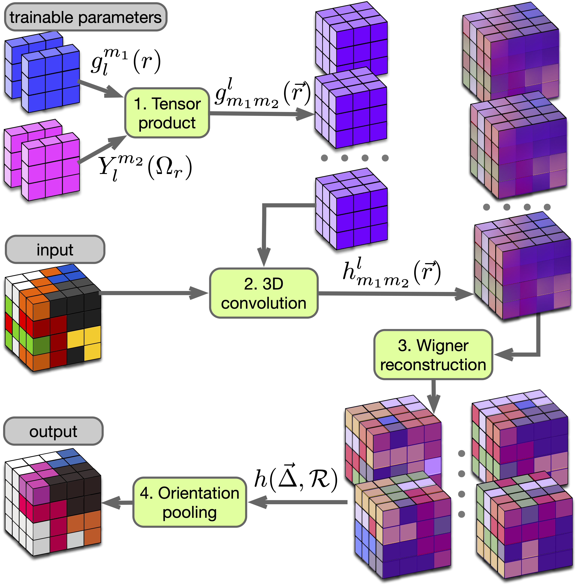

<div align="center">
  
</div>

# ILPO-Net: Invariant to Local Patterns Orientation Network

**Authors:** Dmitrii Zhemchuzhnikov and Sergei Grudinin

**Affiliation:** Univ. Grenoble Alpes, CNRS, Grenoble INP, LJK, 38000 Grenoble, France

A preprint of the paper is available on [arXiv](https://arxiv.org/abs/2403.19612).

## Abstract

Effective recognition of spatial patterns and learning their hierarchy is crucial in modern spatial data analysis. Volumetric data applications seek techniques ensuring invariance not only to shifts but also to pattern rotations. While traditional methods can readily achieve translational invariance, rotational invariance possesses multiple challenges and remains an active area of research. Here, we present ILPO-Net (Invariant to Local Patterns Orientation Network), a novel approach that handles arbitrarily shaped patterns with the convolutional operation inherently invariant to local spatial pattern orientations using the Wigner matrix expansions. Our architecture seamlessly integrates the new convolution operator and, when benchmarked on diverse volumetric datasets such as MedMNIST and CATH, demonstrates superior performance over the baselines with significantly reduced parameter counts – up to 1000 times fewer in the case of MedMNIST. Beyond these demonstrations, ILPO-Net’s rotational invariance paves the way for other applications across multiple disciplines. 


## Repository Structure

The repository contains the source code for ILPO-Net, organized as follows:

```
ILPONet/
│
├── ilponet/
│   ├── __init__.py
│   ├── wigner_functions.py
│   ├── basis_functions.py
│   ├── wigmat_reconstruction.py
│   └── convolution_module.py
│
└── setup.py
```

- `ilponet/`: Contains the implementation of ILPO convolution and its components.
  - `wigner_functions.py` contains functions related to Wigner matrices
  - `basis_functions.py` includes functions for generating basis grids and associated Legendre polynomials
  - `wigmat_reconstruction.py` defines the 'WigmatReconstruction' class, a custom autograd function for Wigner matrix reconstruction
  - `convolution_module.py` contains the implementation of the ILPO convolution operation


## Getting Started

1. Clone the repository:

   ```bash
   git clone https://gricad-gitlab.univ-grenoble-alpes.fr/GruLab/ILPONet.git
   ```

2. Install the required dependencies:

   ```bash
   pip install -r requirements.txt
   ```


## Citation

If you use ILPO-Net in your research, please cite the following paper:

```bibtex
@misc{zhemchuzhnikov2024ilponet,
      title={{ILPO-NET}: Network for the invariant recognition of arbitrary volumetric patterns in 3D}, 
      author={Dmitrii Zhemchuzhnikov and Sergei Grudinin},
      year={2024},
      eprint={2403.19612},
      archivePrefix={arXiv},
      primaryClass={cs.CV}
}
```

## License

This project is licensed under the [MIT License](LICENSE).